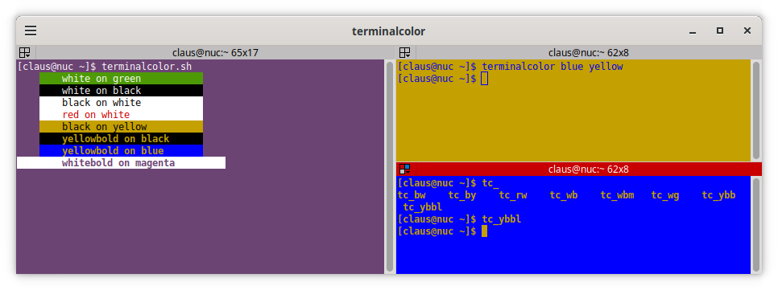

# terminalcolor

A couple of bash scripts to manually set text and background colors in terminals. 

A total of 3 ways exist to set the colors, see the picture below. 





### terminalcolor.sh (the menu to the left)

Shows a menu with the combinations found in the 'terminalcolor.colorscheme' file. Use the arrowkeys to go up and down and press enter to select a combination. It looks kind of cool but can be slightly baffling to use.

The script saves the current selection at exit and uses it as default next time its called. 


### terminalcolor.alias (for sourcing, right side terminals above)

Intended to be sourced in e.g. .bashrc. It will then provide two alternative ways to set the text and background colors directly: 

##### terminalcolor command

Manually set the terminal colors using any of the color definitions available in the file 'terminalcolor.rgb'

```
terminalcolor textcolor backgroundcolor
```

##### tc_*

And there is a few alias terminalcolor commands as well starting with 'tc_'. They are deliberately very condensed and are as a consequence pretty cryptic.


## Misc

The terminalcolor scripts exclusively uses rgb codes for colors which is very customizable but unfortunately also very non-standard. The scripts works on a recent Linux and bash 5.2. Other or older shells are bound to get the scripts into problems, both with regard to syntax and the actual color handling.

Even if the scripts appears to work there is a near 100% guarantee that eventually they will leave a terminal here and there in complete disarray. You have been warned.

The actual color schemes currently available is most of all proof of concepts. Some are probably more strange than useful as of now.

A quick installation could be to plug the two following lines into a .bashrc:

```
. ~/<path>/terminalcolor/terminalcolor.alias
export PATH=$PATH:~/<path>/terminalcolor
```

If a bold attribute is shown in the menu but disappear right away then it is probably an advanced prompt that resets it. Try 'printf "\e[1m"' to see what happens, it should enable bold text.

## Links

The post that kicked this project off
https://unix.stackexchange.com/questions/474502/how-to-set-the-background-color-of-the-linux-console-screen

Actual terminal colors and escapes
https://chrisyeh96.github.io/2020/03/28/terminal-colors.html

The 'inline' menu
https://unix.stackexchange.com/questions/146570/arrow-key-enter-menu/673436#673436


